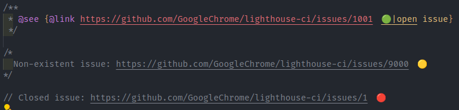

# Issue-Glimpse

Keeps your code comments synchronized with GitHub issue statuses. This VS Code extension enhances your coding workflow by displaying the current status of GitHub issues directly within your code comments. With Issue-Glimpse, you no longer need to toggle back and forth between your editor and GitHub to check if a mentioned issue is code comments is still open or has been closed.

